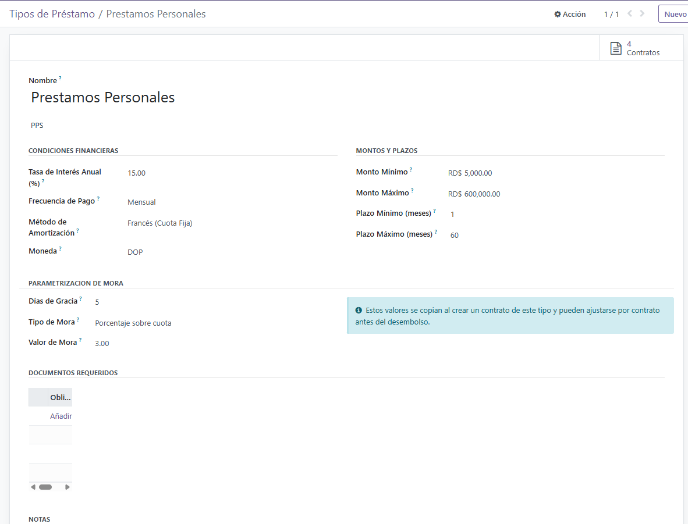
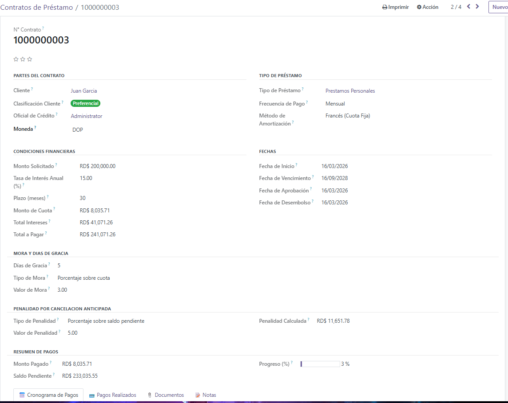
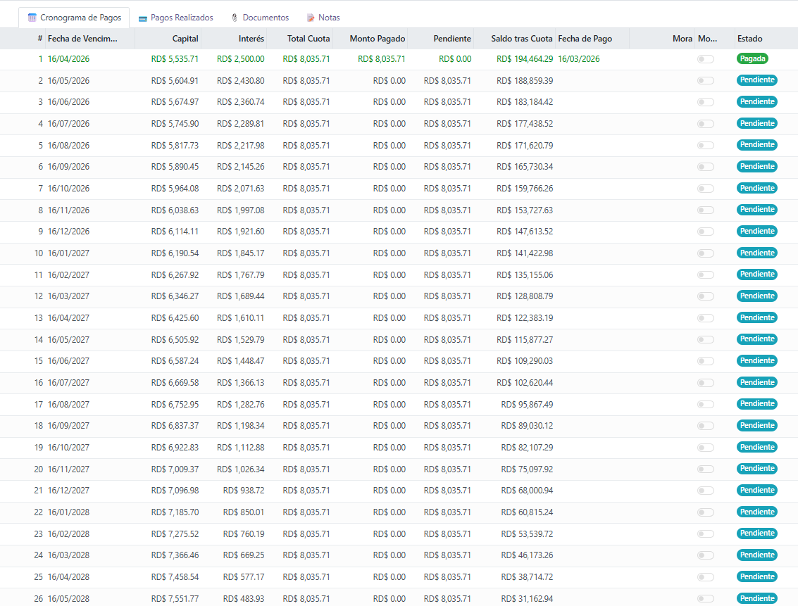
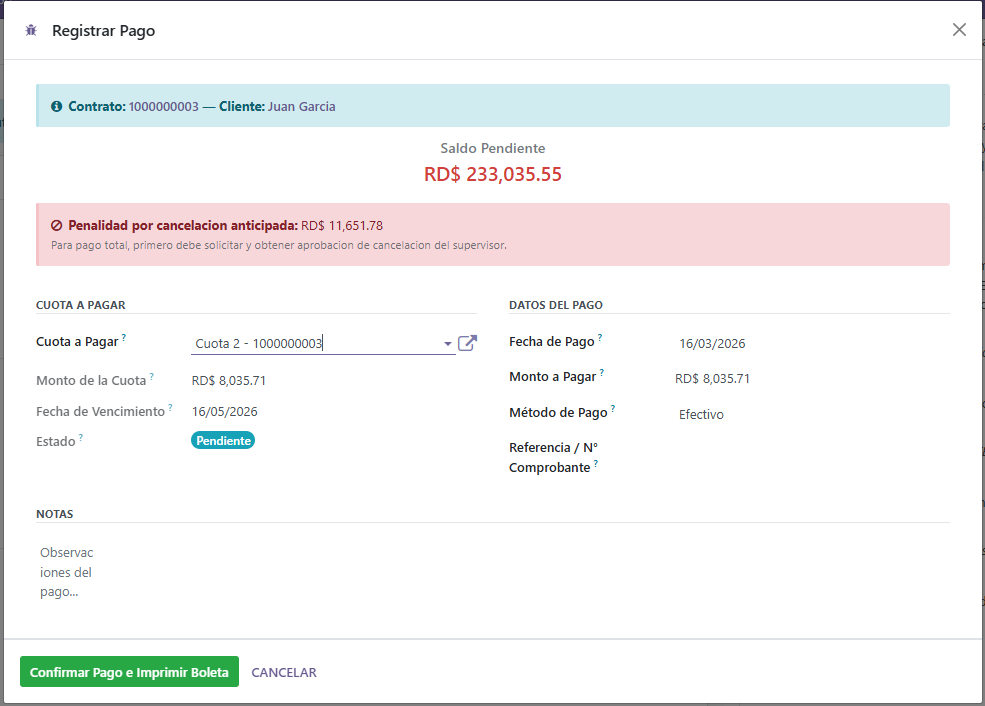

# RST Loan Management for Odoo 16

<div align="center">


</div>

> Solución empresarial para la gestión integral de préstamos en **Odoo 16 Community Edition**, diseñada para controlar productos financieros, contratos, cronogramas de pago, documentación, cobranzas, mora, penalidades, reportes y seguimiento operativo de extremo a extremo.

---

## Tabla de contenido

- [Resumen ejecutivo](#resumen-ejecutivo)
- [Características destacadas](#características-destacadas)
- [Objetivo del módulo](#objetivo-del-módulo)
- [Alcance funcional](#alcance-funcional)
- [Tecnologías y entorno](#tecnologías-y-entorno)
- [Principales funcionalidades](#principales-funcionalidades)
- [Flujo operativo del préstamo](#flujo-operativo-del-préstamo)
- [Estados del contrato](#estados-del-contrato)
- [Gestión de pagos](#gestión-de-pagos)
- [Gestión documental](#gestión-documental)
- [Mora y penalidades](#mora-y-penalidades)
- [Reportes y monitoreo](#reportes-y-monitoreo)
- [Seguridad y control operativo](#seguridad-y-control-operativo)
- [Estructura funcional del módulo](#estructura-funcional-del-módulo)
- [Estructura técnica sugerida](#estructura-técnica-sugerida)
- [Instalación](#instalación)
- [Capturas del módulo](#capturas-del-módulo)
- [Roadmap funcional](#roadmap-funcional)
- [Criterios sugeridos para QA](#criterios-sugeridos-para-qa)
- [Autor](#autor)

---

## Resumen ejecutivo

**RST Loan Management for Odoo 16** es un módulo desarrollado para organizaciones que requieren administrar préstamos de forma centralizada, estructurada y con mayor trazabilidad operativa dentro de **Odoo 16 Community Edition**.

La solución permite controlar el ciclo de vida completo del préstamo, desde la definición del producto financiero hasta la liquidación o cancelación del contrato, integrando controles sobre pagos, cronogramas, documentación, mora, penalidades y seguimiento funcional.

Su propósito es fortalecer la operación diaria, reducir dependencias de controles manuales y proporcionar una base sólida para la supervisión, validación y mejora continua del proceso crediticio.

---

## Características destacadas

- Configuración flexible de tipos de préstamo
- Administración integral de contratos
- Generación y control de cronogramas de cuotas
- Registro de pagos con validaciones por método
- Gestión documental por expediente
- Control de mora, vencimientos y penalidades
- Seguimiento de estados contractuales
- Soporte para cancelación anticipada o liquidación
- Reportes operativos y vistas de monitoreo
- Base funcional para evolución y escalabilidad del módulo

---

## Objetivo del módulo

Automatizar y estandarizar la gestión de préstamos en Odoo mediante una solución robusta que permita administrar contratos, controlar pagos, validar documentación, aplicar reglas de negocio y ofrecer visibilidad operativa a las distintas áreas involucradas en el proceso.

---

## Alcance funcional

El módulo cubre las necesidades funcionales principales de la gestión de préstamos, incluyendo:

- parametrización de productos o tipos de préstamo
- administración de contratos de préstamo
- generación de cronogramas de pago
- registro y validación de cobranzas
- control documental del expediente
- aplicación de mora y penalidades
- consulta de reportes e indicadores operativos
- seguimiento de estados del contrato

---

## Tecnologías y entorno

Este módulo está orientado a trabajar en el siguiente entorno:

- **Odoo 16 Community Edition**
- **Python**
- **PostgreSQL**
- **XML** para vistas y formularios
- **ORM de Odoo** para lógica de negocio y persistencia
- **QWeb / Reportes PDF** para salidas documentales, cuando aplique

---

## Principales funcionalidades

### 1. Configuración de tipos de préstamo

Permite definir productos financieros con sus principales parámetros de negocio, tales como:

- nombre del producto
- monto mínimo y máximo
- tasa de interés
- plazo
- días de gracia
- reglas de penalidad
- configuración documental asociada
- condiciones generales del préstamo

Esta parametrización sirve como base para estandarizar el comportamiento de los contratos asociados a cada producto.

---

### 2. Administración de contratos de préstamo

Permite registrar contratos vinculados a clientes y tipos de préstamo previamente configurados.

Cada contrato puede incluir información como:

- cliente
- tipo de préstamo
- monto aprobado o desembolsado
- fechas relevantes del contrato
- plazo
- saldo pendiente
- estado del contrato
- cronograma asociado
- expediente documental

---

### 3. Generación de cronogramas de cuotas

El módulo permite generar y administrar el cronograma de pagos del préstamo, incluyendo:

- número de cuota
- fecha de vencimiento
- capital
- interés
- monto total
- saldo restante
- estado de la cuota

---

### 4. Registro y aplicación de pagos

Permite registrar pagos sobre cuotas o saldos del préstamo, asegurando consistencia funcional y actualización del estado financiero del contrato.

Incluye control sobre:

- fecha de pago
- contrato asociado
- monto pagado
- método de pago
- distribución del pago
- validaciones de saldo
- actualización de cuotas impactadas
- recalculo del saldo pendiente
- transición de estado del contrato cuando corresponda

---

### 5. Gestión documental del expediente

Permite asociar documentos y evidencias al contrato de préstamo para fines de control, trazabilidad y validación operativa.

Esto facilita:

- control del expediente
- verificación de requisitos documentales
- seguimiento de pendientes
- apoyo a revisiones funcionales y QA

---

### 6. Control de mora y vencimiento

Incluye lógica funcional para:

- identificar cuotas vencidas
- marcar estados de mora
- actualizar contratos vencidos
- aplicar cargos o penalidades según configuración

---

### 7. Cancelación anticipada y liquidación

Permite gestionar escenarios de cierre anticipado o pago total del préstamo, con validaciones operativas alineadas a las reglas de negocio.

---

### 8. Reportes y vistas de seguimiento

Incluye vistas y estructuras orientadas al seguimiento operativo del módulo, facilitando la consulta de:

- contratos
- pagos
- cronogramas
- documentos
- estados contractuales
- comportamiento general de la cartera

---

## Flujo operativo del préstamo

El flujo funcional esperado del módulo es el siguiente:

1. **Configuración del tipo de préstamo**
2. **Creación del contrato**
3. **Selección del producto financiero**
4. **Carga y validación de documentos requeridos**
5. **Generación del cronograma de cuotas**
6. **Aprobación o activación del contrato**
7. **Registro de pagos**
8. **Seguimiento de cuotas y saldo**
9. **Aplicación de mora o penalidades, cuando corresponda**
10. **Cierre por pago completo o cancelación anticipada**

---

## Estados del contrato

El contrato puede transitar por distintos estados operativos durante su ciclo de vida:

| Estado | Descripción |
|--------|-------------|
| `draft` | Contrato en borrador |
| `approved` | Contrato aprobado |
| `active` | Contrato activo |
| `overdue` | Contrato vencido |
| `paid` | Contrato pagado completamente |
| `cancelled` | Contrato cancelado |

### Reglas funcionales relevantes

#### Contrato vencido
Un contrato pasa a estado **vencido** cuando:

- se encuentra activo
- su fecha final ya ha transcurrido
- mantiene saldo pendiente

#### Contrato pagado
Un contrato pasa a estado **pagado** cuando:

- el saldo pendiente llega a cero
- el cierre corresponde al pago final del préstamo

#### Contrato cancelado
Un contrato pasa a estado **cancelado** cuando:

- se realiza una cancelación anticipada aprobada
- o un usuario con privilegios de supervisión ejecuta el cierre conforme a las validaciones del proceso

---

## Gestión de pagos

La gestión de pagos constituye uno de los procesos más sensibles del módulo. Por ello, la lógica funcional debe garantizar que cada pago:

- corresponda al contrato correcto
- no exceda indebidamente el saldo esperado
- utilice un método de pago válido
- impacte correctamente las cuotas relacionadas
- actualice el saldo pendiente
- modifique el estado del contrato cuando aplique

---

## Gestión documental

La documentación requerida forma parte esencial del expediente del préstamo y debe responder a la configuración del producto seleccionado.

### Comportamiento esperado

Al seleccionar un tipo de préstamo en el contrato:

- deben cargarse automáticamente los documentos requeridos asociados al producto
- cada documento debe visualizar:
  - nombre del documento
  - indicador de obligatoriedad
  - estado del archivo: cargado o pendiente

Este enfoque fortalece el control documental, la calidad del expediente y la trazabilidad del proceso.

---

## Mora y penalidades

El módulo incorpora criterios funcionales para la administración de mora y penalidades, incluyendo:

- días de gracia por contrato o producto
- detección de cuotas vencidas
- actualización de estado por mora
- cálculo de penalidades conforme a configuración
- soporte para escenarios de liquidación o cancelación anticipada

---

## Reportes y monitoreo

La solución está orientada a proveer visibilidad operativa mediante:

- consulta de contratos
- seguimiento de cronogramas
- historial de pagos
- control documental
- reportes funcionales o PDF
- dashboards o paneles de operación

Estos elementos permiten fortalecer la supervisión y el análisis de la cartera administrada.

---

## Seguridad y control operativo

El módulo debe operar bajo criterios de seguridad funcional y segregación de responsabilidades.

### Ejemplos de control por perfil

- usuarios operativos con permisos limitados para registrar y consultar
- supervisores con facultades de aprobación y cancelación
- acceso controlado a contratos, pagos y documentos
- visibilidad de información según rol asignado

Este enfoque contribuye a proteger la integridad del proceso y reducir riesgos operativos.

---

## Estructura funcional del módulo

El módulo se organiza funcionalmente en los siguientes componentes:

- **Tipos de préstamo**
- **Contratos**
- **Cronograma de cuotas**
- **Pagos**
- **Documentos**
- **Penalidades**
- **Estados y control operativo**
- **Reportes**
- **Dashboard**

---

## Capturas del módulo

### Vista General


### Tipos de préstamo


### Contrato de préstamo


### Cronograma de cuotas


### Registro de pagos


## Estructura técnica sugerida

Una estructura técnica recomendada para el proyecto podría ser la siguiente:

```bash
rst_loan_management/
├── __init__.py
├── __manifest__.py
├── models/
│   ├── loan_type.py
│   ├── loan_contract.py
│   ├── loan_schedule.py
│   ├── loan_payment.py
│   ├── loan_document.py
│   ├── loan_penalty.py
│   └── res_partner.py
├── views/
│   ├── loan_type_views.xml
│   ├── loan_contract_views.xml
│   ├── loan_schedule_views.xml
│   ├── loan_payment_views.xml
│   ├── loan_document_views.xml
│   ├── loan_penalty_views.xml
│   └── menu_views.xml
├── security/
│   ├── ir.model.access.csv
│   └── security.xml
├── data/
│   ├── sequence_data.xml
│   ├── default_documents_data.xml
│   └── cron_data.xml
├── report/
│   ├── loan_contract_report.xml
│   └── payment_receipt_report.xml
├── wizard/
│   ├── loan_liquidation_wizard.py
│   └── loan_liquidation_wizard_view.xml
├── static/
│   └── description/
│       ├── icon.png
│       └── banner.png
└── README.md